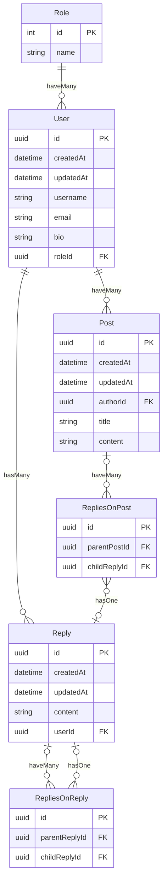

## References and Inspiration

[Hackernews](https://news.ycombinator.com) is the direct inspiration of this project. This project will also take an inspiration from [reddit](https://reddit.com).

## Entities

